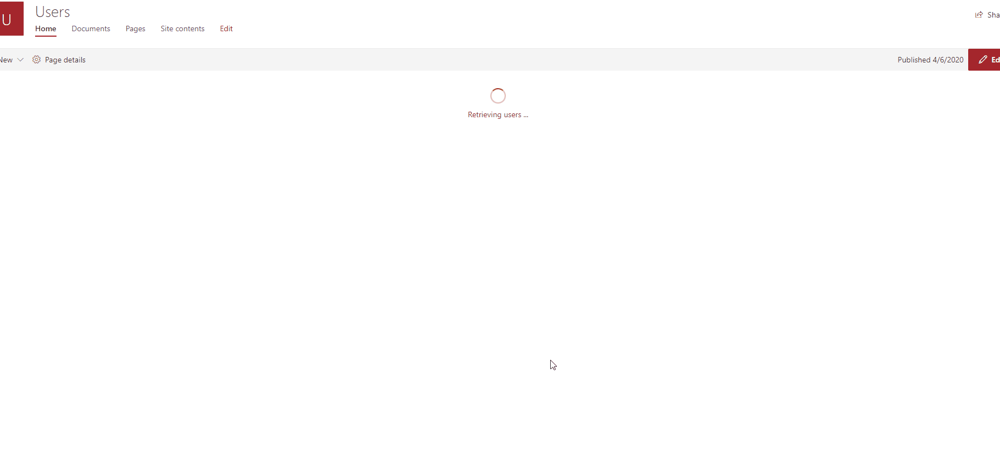
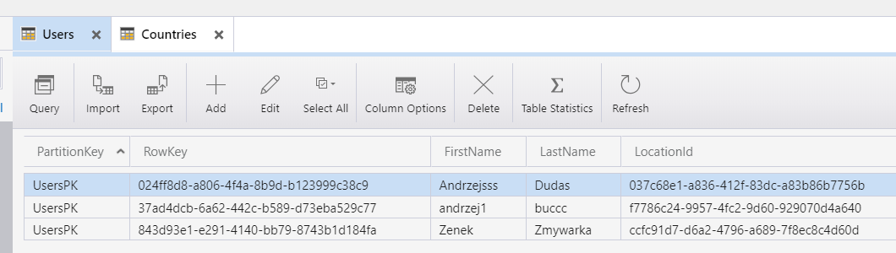

## Case description

### Requirement

Users info needs to be organized with SharePoint application in its simplest form. The
users are grouped per country. CRUD operations needs to be implemented both
country and users.
Implement Quick Search at parent level and child level to search through countries and
users.

### Implementation

Backend
* Implement a SQL DB to store the needed entities and Function on Azure to
retrieve data.
* Use Entity Framework to implement data operation in backend service.

UI
* Create a SPA using SPFx with React framework and Office UI Fabric styling
library
* Prototype UI can be found here, [datatables](https://datatables.net/blog/2019-01-11#Server-side-(PHP))

### Authentication
* Implement AAD secured API in multi-tenant fashion
* Configure APP service authentication and CORS

## Solution

### In Action:

  

### Technologies used:
* Azure Function (PowerShell Core)
* KeyVault
* Storage Tables
* SharePoint Framework

Folder|Description
--------|---------
austriaFunction|Azure Function code
austriaSpfx|SPFx code

### Backend
Storage Table
- Two tables - Users & Countries, with relation
    - 

Azure Function
- works as API to access and perform CRUD on tables
- configured as AAD secured API in multi-tenant fashion & used APP service authentication and CORS ([use-aadhttpclient-enterpriseapi-multitenant](https://docs.microsoft.com/en-us/sharepoint/dev/spfx/use-aadhttpclient-enterpriseapi-multitenant))

### UI
SPFx
- used Office Fabric UI
- consuming API secured with AAD
- PnP Controls used - DetailsList
- Searchable and sortables lists
